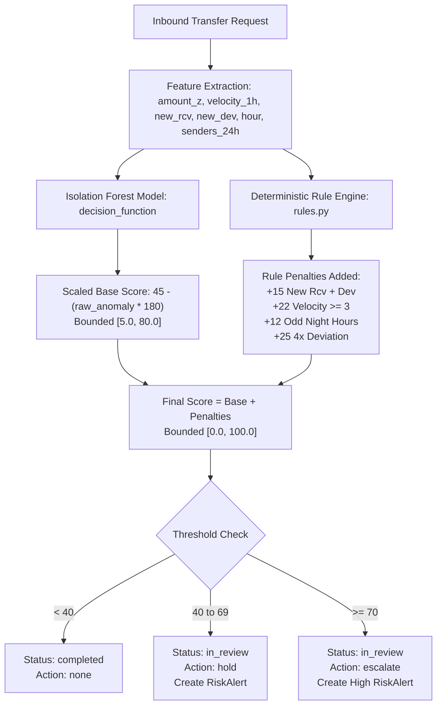

# RemitMind System Audit & Baseline Specification

**Date:** October 7, 2026  
**Baseline Git Branch:** `improve/phase-0-baseline`  
**Initial Test Suite Status:** **33 Passed / 0 Failed** (25.47s)

---

## 1. Technology Stack & Environment

| Component | Technology / Library | Version / Details |
| :--- | :--- | :--- |
| **Backend Framework** | FastAPI + Uvicorn + Starlette | FastAPI >= 0.110.0, Python 3.14 |
| **Data Validation** | Pydantic (v2) | >= 2.6.0 |
| **Database & ORM** | SQLAlchemy with SQLite | SQLite `remitmind.db`, SQLAlchemy >= 2.0 |
| **Machine Learning** | Scikit-Learn, NumPy, Pandas, Joblib | Isolation Forest (`artifacts/isolation_forest_v1.joblib`) |
| **Graph Intelligence** | NetworkX, python-louvain | Louvain community detection, PageRank |
| **Spatial / Geometry** | Shapely | >= 2.0.0 |
| **HTTP & Testing** | Pytest, AnyIO, HTTPX | Pytest 9.1.1, AnyIO 4.15.1, Starlette TestClient |
| **Frontend Architecture**| Vanilla HTML5, CSS3, Vanilla JS (ES6+) | No Node.js build step; served directly via FastAPI StaticFiles |
| **Design System** | Custom Dark/Light theme with CSS Variables | Glassmorphism, Outfit + Inter + JetBrains Mono, Apple-style Dock |

---

## 2. Complete API Route Map (40 Endpoints)

### Transfers & Send Plans
- `POST   /api/v1/plans/recommend` — Calculate 7-day rate forecast, best day to send, fee savings.
- `POST   /api/v1/transfers` — Execute transfer with inline anomaly scoring & alert creation.
- `GET    /api/v1/transfers` — Retrieve transfer ledger (supports query filters).
- `GET    /api/v1/transfers/{id}` — Retrieve detailed record of specific transfer.

### Analyst Risk Operations
- `GET    /api/v1/analyst/alerts` — Fetch risk alert queue (filtered by status, min_score).
- `GET    /api/v1/analyst/alerts/{id}` — Fetch detailed alert payload with forensic indicators.
- `POST   /api/v1/analyst/alerts/{id}/decision` — Record analyst disposition (`approve`, `hold`, `escalate`).

### ScamShield (AegisShield)
- `POST   /api/v1/scamshield/check` — Evaluate transfer metadata and message text for coercion/scam risk.
- `POST   /api/v1/scamshield/verify` — Verify recipient credentials & account safety status.

### SyndicateRadar & Graph Intelligence
- `GET    /api/v1/graph/network` — Export node-link graph data for D3/vis canvas visualization.
- `GET    /api/v1/graph/communities` — Louvain community clusters and mule ring flags.
- `GET    /api/v1/graph/pagerank` — PageRank centrality ranking for transaction graph.
- `GET    /api/v1/graph/node/{node_id}` — Retrieve forensic profile and degree metrics for a node.
- `POST   /api/v1/graph/quarantine` — One-click quarantine of an individual account or syndicate cluster.

### Agent Liquidity & Receiver Portal
- `GET    /api/v1/agents/{id}/forecast` — 7-day cash-out demand forecast (Eid multiplier support).
- `GET    /api/v1/receiver/{id}/summary` — Generate village receiver summary with audio script and goal allocations.

### Macro Resilience & Disaster Simulator
- `GET    /api/v1/resilience/divisions` — Divisional liquidity stress indicators (8 divisions of Bangladesh).
- `GET    /api/v1/resilience/rebalance` — Optimized inter-district liquidity rebalance dispatch plan.
- `POST   /api/v1/resilience/stress-test` — Simulate flood, cyclone, or crisis liquidity drain.

### AegisCompliance & Regulatory STR
- `POST   /api/v1/compliance/generate-str` — Generate BFIU Form 2 STR draft with SHA-256 tamper-evident hash.

### AI Intelligence & Copilot
- `POST   /api/v1/ai/chat` — Multi-turn copilot assistant for analysts and senders.
- `POST   /api/v1/ai/explain-risk` — Plain-language risk explanation grounded in transaction indicators.
- `POST   /api/v1/ai/receiver-advice` — Financial literacy advice for rural receivers.
- `POST   /api/v1/ai/agent-liquidity` — AI narrative summary for agent liquidity positions.
- `GET    /api/v1/ai/models` — Query status and availability of connected LLM engines.

### Fairness, Auditing & Development
- `GET    /api/v1/metrics/fairness` — Statistical parity across corridors and demographics.
- `GET    /api/v1/metrics/demographic-parity` — Demographic parity metrics across corridor cohorts.
- `POST   /api/v1/dev/seed` — Seed or reseed SQLite database with synthetic records.
- `GET    /api/v1/dev/scenarios` — Enumerate pre-configured adversarial test scenarios.
- `POST   /api/v1/dev/replay-attack` — Inject structured adversarial attack patterns.

### Documentation & Health Probes
- `GET    /api/v1/docs` — List architecture and system documentation articles.
- `GET    /api/v1/docs/{slug}` — Fetch markdown content for specific documentation article.
- `GET    /health` — Liveness check and model status indicator.
- `GET    /health/ready` — Readiness probe verifying database connectivity and record counts.

### Frontend Application Routes
- `GET    /` & `GET /index.html` — Public Landing Page & Interactive Showcase.
- `GET    /app` & `GET /app.html` — RemitMind Unified Application & Analyst Console.
- `GET    /login` & `GET /login.html` — Role-based Login & Persona Switcher.

---

## 3. Current Risk-Scoring Flow Architecture



### Known Deficiencies in Current Model
1. **Unsupervised Only:** Isolation Forest trained on 500 normal synthetic points; no ground-truth supervised fraud discrimination.
2. **Rule String Explanations:** Explanations are deterministic string lookups rather than feature importance attributions (SHAP).
3. **Coarse Temporal & Device Signals:** `velocity_1h` and `hour_of_day` only; `is_new_device` is an uncalibrated boolean without device age or SIM history.
4. **No Uncertainty Quantification:** Binary thresholds (40 / 70) without conformal prediction confidence sets or doubt routing.

---

## 4. UI Screen & View Catalog

| Screen / View Name | File Location | Route / Selector | Primary Features & Components |
| :--- | :--- | :--- | :--- |
| **Landing & Showcase** | `frontend/index.html` | `/`, `/index.html` | Hero, Corridor rate forecaster, Interactive fraud sandbox, Bangla receiver portal demo, Agent demand bar chart, Syndicate graph preview, BFIU STR showcase, Apple-style Dock. |
| **Send Money** | `frontend/app.html` | `/app` (`tab: pay`) | Corridor selection (AED, SAR, MYR, EUR, USD), 7-day rate forecast, Goal allocation sliders, Recipient info, ScamShield coercion detector, 3DS payment modal. |
| **Risk Ops (Analyst)** | `frontend/app.html` | `/app` (`tab: analyst`) | High/medium/low priority queue, Risk gauge, Rule penalty breakdown, Action buttons (Approve, Hold, Escalate), Case notes, Filter controls. |
| **Receiver View** | `frontend/app.html` | `/app` (`tab: receiver`) | Rural Bangla localized interface, Voice read-out (Web Speech API), Goal distribution visualizer (Rice, School, Healthcare). |
| **Agent Cash** | `frontend/app.html` | `/app` (`tab: agent`) | 7-day cash demand forecast, Eid-ul-Fitr / Eid-ul-Adha 2.5x multiplier toggle, Agent liquidity balance cards, Float depletion runway alert. |
| **Transactions Ledger**| `frontend/app.html` | `/app` (`tab: ledger`) | Searchable transaction table, Live status pills, Transfer metadata inspection, Amount formatting. |
| **Syndicate Radar** | `frontend/app.html` | `/app` (`tab: syndicate`)| Visual network graph, Louvain community clustering, PageRank centrality highlighting, Quarantine action modal. |
| **Macro Resilience** | `frontend/app.html` | `/app` (`tab: resilience`)| 8-division stress test matrix, Disaster crisis simulator (Floods, Cyclones), Inter-district float rebalancing recommendations. |
| **Threat Lab** | `frontend/app.html` | `/app` (`tab: simulator`) | Adversarial attack replay runner (`/dev/replay-attack`), Scenario injector, Behavioral comparison metrics. |
| **BFIU STR Filing Modal**| `frontend/app.html` | `#str-modal` | Regulatory Form 2 Suspicious Transaction Report generation, SHA-256 tamper-evident integrity hash, JSON export. |
| **AI Copilot Drawer** | `frontend/app.html` | `#floating-ai-copilot` | Floating assistant drawer, Grounded risk case explanation, Contextual query engine. |
| **Login & Persona Hub**| `frontend/login.html` | `/login`, `/login.html` | Role selector (Sender, Analyst, Cash Agent, Receiver, Admin), One-click demo credential autofill. |

---

## 5. Test Suite Baseline Verification

Executed on October 7, 2026 using Python 3.14 virtual environment:
```
============================= test session starts =============================
platform win32 -- Python 3.14.6, pytest-9.1.1, pluggy-1.6.0
collected 33 items

backend\tests\test_api.py ...............                                [ 45%]
backend\tests\test_compliance.py ...                                     [ 54%]
backend\tests\test_graph.py .......                                      [ 75%]
backend\tests\test_resilience.py ....                                    [ 87%]
backend\tests\test_scamshield.py ....                                    [100%]

======================= 33 passed, 2 warnings in 25.47s =======================
```
All 33 baseline tests pass without failure.
