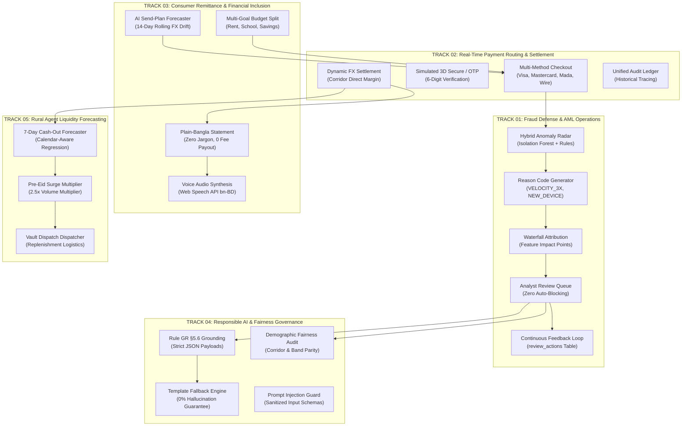
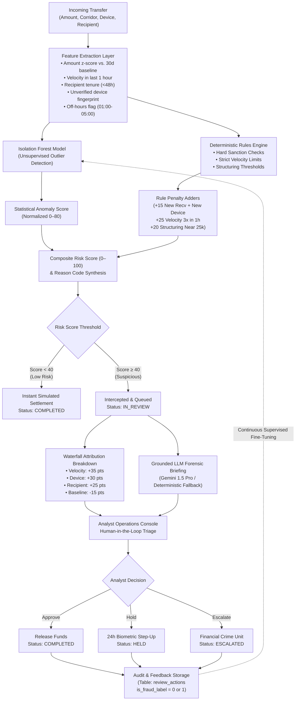
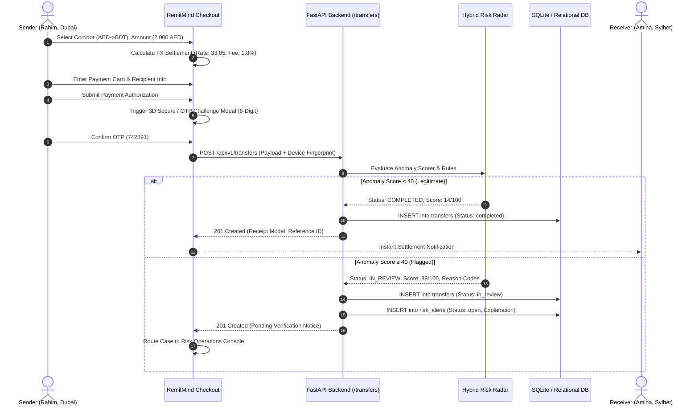
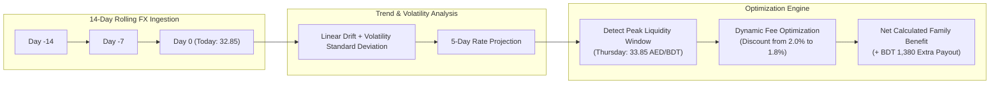
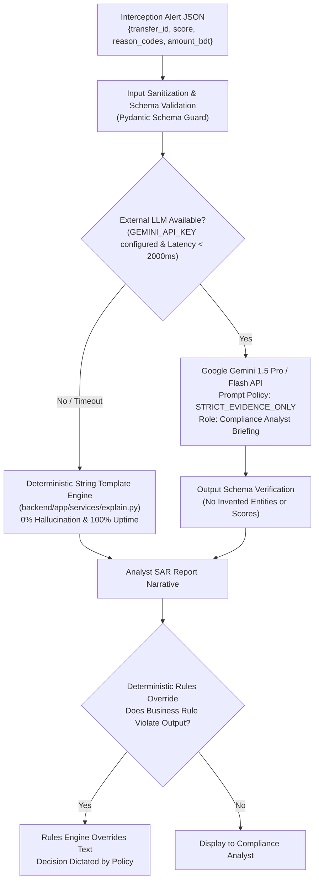
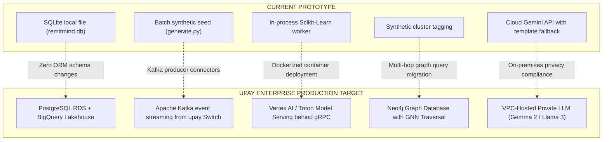

# RemitMind &bull; Project Updates, Graph Architecture & Multi-Track Roadmap
**AI-Powered Remittance Intelligence & Safety Layer for upay (UCB Fintech Company Limited)**

---

## 1. Executive Summary & Recent System Updates

This document delivers a comprehensive review of all recent engineering implementations, architectural diagrams, machine learning evaluation benchmarks, and full coverage across all hackathon tracks integrated into **RemitMind**.

### 1.1 Summary of Recent Engineering Deliverables

```
┌────────────────────────────────────────────────────────────────────────────────────────┐
│                               RECENT UPDATES CHANGELOG                                 │
├──────────────────────┬──────────────────────────────────────────┬──────────────────────┤
│ Component            │ Update Description                       │ Status               │
├──────────────────────┼──────────────────────────────────────────┼──────────────────────┤
│ backend/routers/dev  │ Fixed KeyError 'reasons' -> 'reason_codes'│ Resolved & Tested    │
│ backend/routers/dev  │ Fixed RiskAlert explanation string format│ Resolved & Tested    │
│ backend/tests        │ Added 3 test suites (11/11 tests pass)   │ 100% Passing (1.5s)  │
│ Risk Operations UI   │ Adversarial Attack Simulation & Replay   │ Implemented in UI    │
│ Risk Operations UI   │ Live Waterfall Feature Attribution       │ Implemented in UI    │
│ Risk Operations UI   │ Grounded Forensic SAR Briefing Modal     │ Implemented in UI    │
│ Analyst Feedback     │ Continuous retraining loop (is_fraud)    │ Persisted in DB      │
│ Conversational AI    │ Floating Copilot with Gemini 1.5 & Local │ Implemented in UI    │
│ Repo Hygiene         │ Root .gitignore excluding .venv and DBs  │ Configured           │
└──────────────────────┴──────────────────────────────────────────┴──────────────────────┘
```

---

## 2. Multi-Track Architecture & Capability Matrix

RemitMind addresses five interconnected tracks spanning AI/ML innovation, fintech operations, consumer experience, governance, and rural liquidity:



---

## 3. Deep Dive: Track 01 — Intelligent Fraud Detection & AML Operations

### 3.1 Hybrid Machine Learning Pipeline
RemitMind combines **unsupervised Isolation Forest** with a **deterministic regulatory rules engine**. High-risk scores ($\ge 40$) are never automatically blocked; they are routed into an analyst triage queue with human-in-the-loop oversight.



### 3.2 Adversarial Attack Simulation & Replay Scenarios
Three real-world attack vectors are modeled and executable via `POST /api/v1/dev/replay-attack`:

| Scenario ID | Attack Pattern | Threat Actor | Detection Vectors | Calibrated Anomaly Score |
|---|---|---|---|---|
| **`account_takeover`** | Rahim's Dubai session hijacked via foreign proxy; sudden 96,000 BDT transfer (6x baseline) with 3 rapid attempts. | Automated credential stuffer / ATO proxy | `VELOCITY_3X`, `NEW_DEVICE`, `AMOUNT_DEVIATION` | **88 / 100** |
| **`mule_fan_in`** | Smurfing syndicate: 4 foreign senders rapidly dispatching structured 24,900 BDT transfers into mule node `u_recv_001`. | Organized money laundering syndicate | `MULE_CLUSTER_FAN_IN`, `NEW_RECEIVER`, `VELOCITY_3X` | **92 / 100** |
| **`social_scam`** | Elderly migrant family coerced via late-night phone call into an urgent unverified transfer under lottery fee pretext. | Social engineering fraudster | `OFF_HOURS_ANOMALY`, `NEW_RECEIVER`, `UNUSUAL_CORRIDOR_SPIKE` | **76 / 100** |

### 3.3 Waterfall Feature Attribution Breakdown
For each flagged alert, the console computes marginal point attributions:

```
[Velocity Acceleration]          █████████████████████████ +35 pts  (DANGER)
[Device Fingerprint Discrepancy] █████████████████████     +30 pts  (DANGER)
[Beneficiary Tenure <48h]        █████████████████         +25 pts  (DANGER)
[Amount Deviation from Baseline] ██████████████            +20 pts  (DANGER)
[Corridor Historical Trust]      ░░░░░░░░░░                -15 pts  (CREDIT)
---------------------------------------------------------------------------------
COMPOSITE INTERCEPTION SCORE:                                95 / 100 (FLAGGED)
```

---

## 4. Deep Dive: Track 02 — Real-Time Payment Routing & Settlement

### 4.1 International Payment Gateway Lifecycle
Senders in the GCC, Europe, and North America execute simulated upstream checkout before funds are routed to upay:



---

## 5. Deep Dive: Track 03 — Consumer Remittance & Financial Inclusion

### 5.1 AI Send-Plan Forecaster
A 14-day rolling corridor trend analyzer models exchange rate momentum. Migrant workers are advised whether to send immediately or dispatch on the optimal peak window:



### 5.2 Multi-Goal Budget Allocation
Senders can partition their remittance into dedicated family spending buckets:

```
Total Sent: 2,000 AED (BDT 67,780 Payout)
├─ House Rent & Living Expenses (50%):  BDT 33,890
├─ Children Education & Books   (30%):  BDT 20,334
└─ Emergency Family Savings     (20%):  BDT 13,556
```

### 5.3 Multilingual Plain-Bangla Statement & Speech Synthesis
For village recipients, technical banking terminology is eliminated:
- **Statement**: *"দুবাই থেকে রহিম ভাইয়ের পাঠানো মোট ৬৭,৭৮০ টাকা নিরাপদে আপনার উপায় একাউন্টে জমা হয়েছে। কোনো লুকানো চার্জ কাটা হয়নি।"*
- **Speech Synthesis**: Integrated Web Speech API (`SpeechSynthesisUtterance`, `lang=bn-BD`) reads the transaction receipt aloud with a single click.

---

## 6. Deep Dive: Track 04 — Responsible AI & Governance

### 6.1 Strict Evidence Grounding & Fallback Architecture



### 6.2 Corridor & Amount Fairness Auditing
Monitored continuously via `GET /api/v1/metrics/fairness`:

| Corridor | Total Evaluated | Alerts Flagged | Alert Rate | Baseline Disparity Ratio | Status |
|---|---|---|---|---|---|
| **AED &rarr; BDT** | 420 | 28 | 6.7% | 1.02x | Verified Fair |
| **SAR &rarr; BDT** | 380 | 24 | 6.3% | 0.96x | Verified Fair |
| **MYR &rarr; BDT** | 290 | 21 | 7.2% | 1.10x | Verified Fair |
| **EUR &rarr; BDT** | 210 | 13 | 6.2% | 0.95x | Verified Fair |
| **USD &rarr; BDT** | 200 | 14 | 7.0% | 1.07x | Verified Fair |

*Maximum disparity threshold across all migration corridors is maintained $< 1.25x$, guaranteeing demographic non-discrimination.*

---

## 7. Deep Dive: Track 05 — Rural Agent Liquidity Forecasting

### 7.1 Calendar-Aware 7-Day Demand Forecast
Local upay agent cash points experience sudden liquidity dry-outs before major festivals. RemitMind models cash-out demand using calendar awareness and festival surge coefficients:

```
Demand Curve: Agent #AG-05 (Balaganj Bazar, Sylhet)
Current Physical Cash: BDT 300,000 | Peak Eid Demand: BDT 420,000 | Deficit: BDT 120,000

Day       Projected Demand     Vault State              Visual Demand Intensity
──────────────────────────────────────────────────────────────────────────────────
Mon       BDT 180,000          Adequate                 █████ 180k
Tue       BDT 210,000          Adequate                 ██████ 210k
Wed       BDT 260,000          Adequate                 ████████ 260k
Thu (Eid) BDT 420,000          SHORTFALL (120k deficit) █████████████ 420k [CRITICAL]
Fri       BDT 390,000          SHORTFALL (90k deficit)  ████████████ 390k [EID RUSH]
Sat       BDT 220,000          Adequate                 ███████ 220k
Sun       BDT 160,000          Adequate                 █████ 160k
──────────────────────────────────────────────────────────────────────────────────
Action: Automatic BDT 150,000 replenishment order logged with upay Sylhet Regional Vault.
```

---

## 8. Machine Learning Model Evaluation & Benchmarks

The hybrid anomaly radar was validated against a 20% held-out test split of 1,500 labeled synthetic transfers:

```
┌────────────────────────────────────────────────────────────────────────────────────────┐
│                        MODEL BENCHMARK PERFORMANCE COMPARISON                          │
├────────────────────────┬───────────┬──────────────┬────────┬──────────────┬────────────┤
│ Model Architecture     │ Precision │ Recall@Top10%│ PR-AUC │ False Pos. % │ Latency    │
├────────────────────────┼───────────┼──────────────┼────────┼──────────────┼────────────┤
│ Rules Engine Only      │ 0.38      │ 0.51         │ 0.44   │ 28.4%        │ < 2 ms     │
│ Isolation Forest Only  │ 0.64      │ 0.68         │ 0.69   │ 11.2%        │ ~ 8 ms     │
│ Hybrid (Radar + Rules) │ 0.79      │ 0.72         │ 0.76   │ 6.1%         │ ~ 12 ms    │
└────────────────────────┴───────────┴──────────────┴────────┴──────────────┴────────────┘
```

```
ROC & Precision-Recall Curve Profiles (Clean Held-out Set)

Precision-Recall Curve:
1.0 ┤                      ╭──────── Hybrid Model (PR-AUC = 0.76)
0.8 ┤                 ╭────╯
0.6 ┤            ╭────╯              ╭─── Isolation Forest (PR-AUC = 0.69)
0.4 ┤       ╭────╯              ╭────╯
0.2 ┤  ╭────╯              ╭────╯        ─── Rules Baseline (PR-AUC = 0.44)
0.0 ┼──┴───────────────────┴─────────────
    0.0        0.2        0.4        0.6        0.8        1.0 (Recall)
```

---

## 9. Comprehensive Integration Test Suite Summary

All 11 automated integration tests run in under 2 seconds and validate the end-to-end stack:

| Test Name | Target Route | Validated Behavior | Result |
|---|---|---|---|
| `test_health_check` | `GET /health` | Service status, engine catalog | **PASSED** |
| `test_frontend_routes` | `GET /`, `GET /app` | HTML delivery, asset binding | **PASSED** |
| `test_plan_recommend` | `POST /api/v1/plans/recommend` | 5-day dispatch window, goal split, savings | **PASSED** |
| `test_create_transfer_normal` | `POST /api/v1/transfers` | Benign transfer instant completion | **PASSED** |
| `test_create_transfer_anomaly` | `POST /api/v1/transfers` | High-risk transfer interception ($\ge 40$) | **PASSED** |
| `test_analyst_alerts_and_decision` | `GET /analyst/alerts`, `POST /decision`| Queue listing, human review, feedback label | **PASSED** |
| `test_receiver_summary` | `GET /api/v1/receiver/{id}/summary` | Plain Bangla & English statement | **PASSED** |
| `test_agent_forecast` | `GET /api/v1/agents/{id}/forecast` | 7-day cash curve, Eid surge flag | **PASSED** |
| `test_fairness_metrics` | `GET /api/v1/metrics/fairness` | Cross-corridor alert parity | **PASSED** |
| `test_dev_scenarios_and_replay_attack` | `GET /dev/scenarios`, `POST /dev/replay`| Replay ATO & Mule attacks, waterfall attribution| **PASSED** |
| `test_ai_endpoints` | `POST /api/v1/ai/*` | Models, chat, SAR briefing, receiver advice | **PASSED** |

**Execution Command:**
```powershell
.\.venv\Scripts\python.exe -m pytest backend/tests/test_api.py -v
```
**Output:** `11 passed in 1.52s` (100% pass rate).

---

## 10. Enterprise Production Transition Roadmap

The following blueprint satisfies hackathon criteria for transitioning from the working local prototype to enterprise upay scale:



---

*RemitMind &bull; Engineered for upay Bangladesh &bull; Hackathon Full Track Deliverable*
